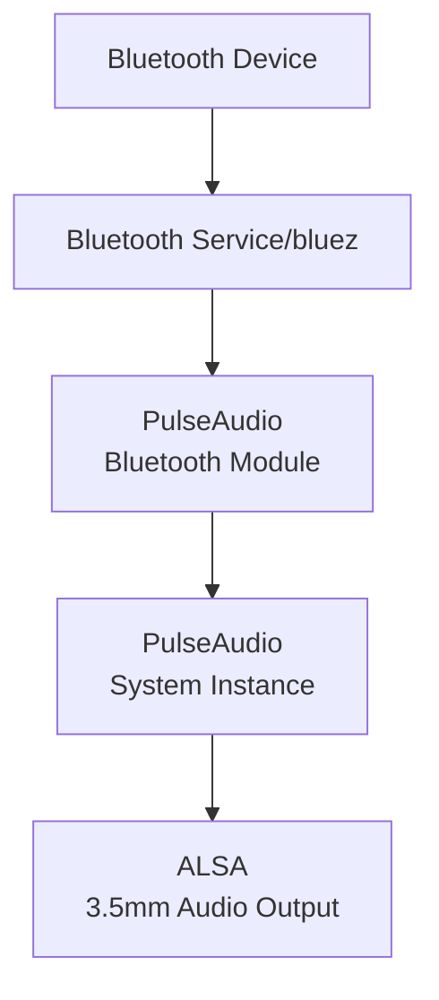
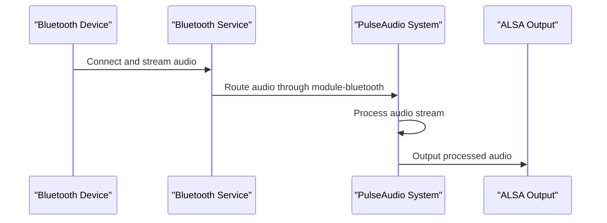

# Bluetooth Audio Integration for Pixie

This document outlines how to set up Bluetooth audio capabilities on the Raspberry Pi, allowing it to automatically present itself as a Bluetooth speaker (A2DP sink) without PIN authentication and integrate with the PulseAudio middleware.

## Architecture Overview



## Implementation Details

The Bluetooth audio integration builds upon the PulseAudio middleware architecture by:

1. Installing necessary Bluetooth packages
2. Configuring PulseAudio with Bluetooth modules
3. Setting up automatic Bluetooth device discovery and connection at boot
4. Setting Bluetooth device class to audio sink (0x240414)
5. Configuring PIN-less authentication for seamless pairing
6. Routing Bluetooth audio through PulseAudio to the system output



## Components

### 1. Boot Services

Three systemd services ensure that Bluetooth is properly configured at boot:

1. **bluetooth-boot.service**: Configures Bluetooth to be discoverable and pairable at boot
   ```ini
   [Unit]
   Description=Bluetooth Audio Sink Service
   After=bluetooth.service pulseaudio.service
   Requires=bluetooth.service

   [Service]
   Type=simple
   ExecStartPre=/bin/sleep 2
   ExecStart=/bin/bash -c 'bluetoothctl power on && bluetoothctl discoverable on && bluetoothctl pairable on && bluetoothctl agent NoInputNoOutput && bluetoothctl default-agent'
   ExecStartPost=/bin/bash -c 'hciconfig hci0 class 0x240414'
   Restart=on-failure
   RestartSec=10
   StandardOutput=journal

   [Install]
   WantedBy=multi-user.target
   ```

2. **a2dp-agent.service**: Handles Bluetooth audio connections without requiring input/output
   ```ini
   [Unit]
   Description=Bluetooth A2DP Agent Service
   After=bluetooth.service pulseaudio.service bluetooth-boot.service
   Requires=bluetooth.service

   [Service]
   Type=simple
   ExecStart=/usr/bin/bt-agent -c NoInputNoOutput
   Restart=on-failure
   RestartSec=5
   StandardOutput=journal

   [Install]
   WantedBy=multi-user.target
   ```

3. **simple-agent.service**: Provides automatic PIN-less pairing
   ```ini
   [Unit]
   Description=Bluetooth Simple Agent
   After=bluetooth.service
   Requires=bluetooth.service

   [Service]
   Type=simple
   ExecStart=/usr/local/bin/simple-agent
   Restart=on-failure
   RestartSec=5

   [Install]
   WantedBy=multi-user.target
   ```

### 2. Bluetooth Configuration

The Bluetooth configuration file `/etc/bluetooth/main.conf` is set up to ensure Pixie presents itself as an audio device and doesn't require PIN authentication:

```ini
[General]
Name = Pixie
Class = 0x240414
DiscoverableTimeout = 0
PairableTimeout = 0
AutoEnable=true

[Policy]
AutoEnable=true

[LE]
MinConnectionInterval=7
MaxConnectionInterval=9
ConnectionLatency=0
ConnectionSupervisionTimeout=600
Secure=true

[Security]
# Disable PIN authentication
NoInputNoOutput=true
```

### 3. Simple Agent for Automatic Pairing

A custom Python script (`/usr/local/bin/simple-agent`) automatically handles pairing requests without requiring PIN entry:

```python
#!/usr/bin/python3
# This agent automatically accepts pairing requests and handles authentication
# without requiring PIN input
from gi.repository import GLib
import dbus
import dbus.service
import dbus.mainloop.glib

AGENT_INTERFACE = "org.bluez.Agent1"
AGENT_PATH = "/test/agent"

class Agent(dbus.service.Object):
    # Methods that automatically handle pairing requests
    # and bypass PIN authentication
    
    @dbus.service.method(AGENT_INTERFACE, in_signature="ou", out_signature="")
    def RequestConfirmation(self, device, passkey):
        # Automatically confirm pairing without user interaction
        return
```

### 4. PulseAudio Bluetooth Modules

The PulseAudio configuration is extended with Bluetooth modules:

```
### Bluetooth Support
.ifexists module-bluetooth-policy.so
load-module module-bluetooth-policy
.endif

.ifexists module-bluetooth-discover.so
load-module module-bluetooth-discover
.endif
```

## Helper Scripts

### bluetooth-config.sh

A helper script is provided to manually configure Bluetooth settings if needed:

```bash
#!/bin/bash
# Configure Bluetooth for Pixie
sudo bluetoothctl power on
sudo bluetoothctl discoverable on
sudo bluetoothctl pairable on
sudo bluetoothctl agent NoInputNoOutput
sudo bluetoothctl default-agent
sudo hciconfig hci0 class 0x240414
sudo hciconfig hci0 name Pixie
sudo systemctl restart bluetooth
sudo systemctl restart bluetooth-boot.service
sudo systemctl restart a2dp-agent.service
sudo systemctl restart simple-agent.service
```

## Using Bluetooth Audio

### Pairing a New Device

1. Your Raspberry Pi should automatically be discoverable as "Pixie" after booting.

2. On your Bluetooth device (phone, tablet, laptop):
   - Open Bluetooth settings
   - Search for new devices
   - Select "Pixie" from the list
   - Connection and pairing will happen automatically without PIN authentication

3. Once paired, connect from your device and start playing music.

### Managing Bluetooth Connections

You can manage Bluetooth connections using the `audio-control.sh` script:

```bash
# List paired devices
/home/pi/bin/audio-control.sh bluetooth list

# Connect to a specific device
/home/pi/bin/audio-control.sh bluetooth connect XX:XX:XX:XX:XX:XX

# Disconnect from connected device
/home/pi/bin/audio-control.sh bluetooth disconnect

# Scan for new devices
/home/pi/bin/audio-control.sh bluetooth scan

# Pair with a device
/home/pi/bin/audio-control.sh bluetooth pair XX:XX:XX:XX:XX:XX
```

### Manually Configure Bluetooth

If you need to manually configure Bluetooth (e.g., if it's not discoverable after a reboot):

```bash
/home/pi/bin/bluetooth-config.sh
```

## Troubleshooting

### Bluetooth Not Discoverable After Boot

Run the manual configuration script:
```bash
/home/pi/bin/bluetooth-config.sh
```

### Check Bluetooth Service Status

```bash
sudo systemctl status bluetooth
sudo systemctl status bluetooth-boot.service
sudo systemctl status a2dp-agent.service
sudo systemctl status simple-agent.service
```

### Restart Bluetooth Services

```bash
sudo systemctl restart bluetooth
sudo systemctl restart bluetooth-boot.service
sudo systemctl restart a2dp-agent.service
sudo systemctl restart simple-agent.service
```

### Check Device Class

The device class should be set to 0x240414 (Audio sink):
```bash
sudo hciconfig hci0
```

### Verify PulseAudio Bluetooth Modules

```bash
sudo -u pulse pactl list modules | grep bluetooth
```

### Problems with Pairing Without PIN

If pairing without PIN isn't working:
```bash
sudo systemctl restart simple-agent.service
sudo bluetoothctl agent NoInputNoOutput
sudo bluetoothctl default-agent
```

### Problems Connecting or Streaming

Reset the Bluetooth stack:
```bash
sudo systemctl stop bluetooth
sudo hciconfig hci0 down
sudo hciconfig hci0 up
sudo systemctl start bluetooth
sudo systemctl restart bluetooth-boot.service
sudo systemctl restart a2dp-agent.service
sudo systemctl restart simple-agent.service
```