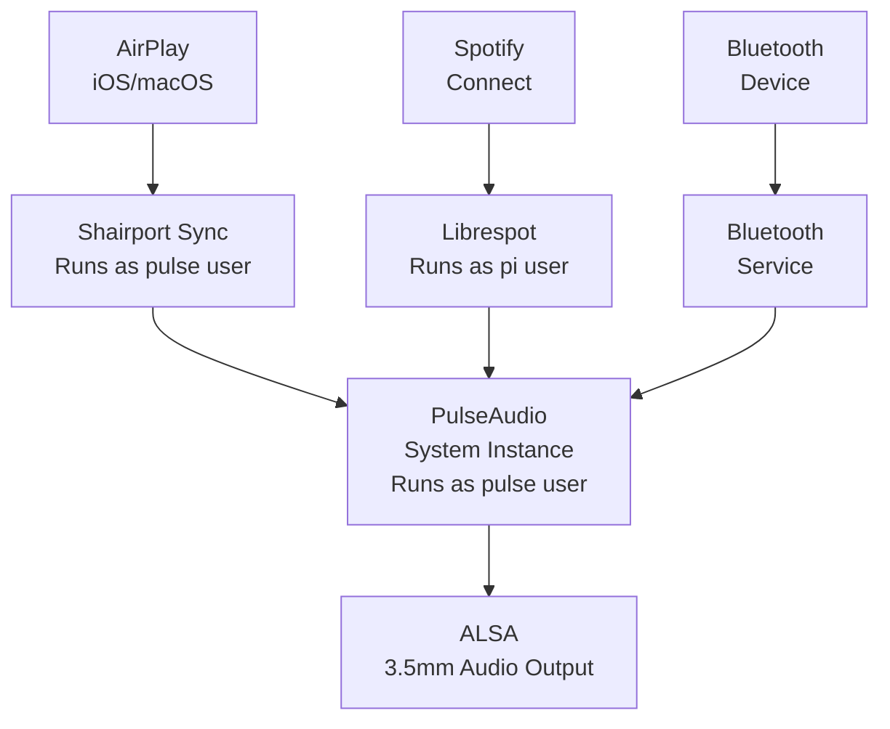
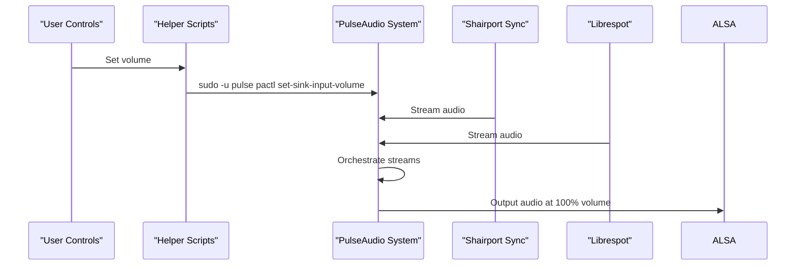

# PulseAudio Middleware Architecture for Pixie

This document outlines the setup of PulseAudio as a central audio middleware for orchestrating multiple audio sources (Shairport Sync, Librespot, and Bluetooth) on the Raspberry Pi, with consistent volume handling and output to the 3.5mm jack.

## Directory Structure

```
/home/pi/Desktop/nico-hoff/Pixie/audio/
├── docs/             # Documentation files
├── config/           # Configuration files for services
├── scripts/          # Helper scripts for audio management
├── systemd/          # Systemd service and timer definitions
└── setup.sh          # Main setup script
```

## Architecture Overview



## Implementation Details

The architecture leverages the existing system-wide PulseAudio instance running as the 'pulse' user to provide a central middleware for audio routing. This approach has several advantages:

1. It allows multiple audio sources to be managed centrally
2. Volume can be controlled both at the individual source level and master level
3. It provides a stable and consistent audio output configuration
4. It handles seamless switching between different audio sources



## Technical Considerations

### System-Wide vs. User PulseAudio

We chose to use the system-wide PulseAudio instance instead of a user instance for several reasons:

1. **Service Integration**: Services like Shairport Sync and Librespot run as system services, making it more straightforward to connect to a system-wide PulseAudio instance.
2. **Stability**: The system-wide PulseAudio instance is managed by systemd and has better stability for long-running operations.
3. **Resource Management**: A single PulseAudio instance consumes fewer resources than multiple user instances.

### User and Group Permissions

The key to making this architecture work is proper user and group management:

- Shairport Sync runs as the `pulse` user, giving it direct access to PulseAudio
- Librespot runs as the `pi` user (where it's installed), but audio is properly routed through PulseAudio
- Helper scripts use `sudo -u pulse` to issue commands to the PulseAudio system instance

## Implementation Steps

### 1. Service Configuration

We configured Shairport Sync to run as the 'pulse' user to allow direct access to PulseAudio without requiring environment variable configuration:

```ini
[Unit]
Description=Shairport Sync - AirPlay Audio Receiver
After=network.target
Wants=network-online.target avahi-daemon.service

[Service]
Type=simple
Restart=on-failure
ExecStart=/usr/bin/shairport-sync $DAEMON_ARGS
User=pulse
Group=pulse

[Install]
WantedBy=multi-user.target
```

For Librespot, we keep it running as the 'pi' user since that's where it's installed:

```ini
[Unit]
Description=Librespot Spotify Connect client
After=network.target
Wants=network-online.target

[Service]
Type=simple
User=pi
Group=audio
ExecStart=/home/pi/.cargo/bin/librespot --name "Pixie" --bitrate 320 --enable-volume-normalisation --initial-volume 60
Restart=always
RestartSec=10

[Install]
WantedBy=multi-user.target
```

### 2. Shairport Sync Configuration

We simplified the Shairport Sync configuration to use PulseAudio as its backend:

```
general = {
    name = "Pixie";
    output_backend = "pa";
};

pa = {
    application_name = "Shairport Sync";
};
```

### 3. Helper Scripts

We created several helper scripts to make it easy to manage the audio system:

#### Status and Monitoring

The `audio-status.sh` script provides a quick overview of the audio system's current state:

```bash
#!/bin/bash

echo "==== PULSEAUDIO SINKS ===="
sudo -u pulse pactl list sinks short

echo -e "\n==== AUDIO STREAMS ===="
sudo -u pulse pactl list sink-inputs short

echo -e "\n==== ALSA MIXER ===="
amixer -c 0 get PCM
```

#### Volume Management

The `ensure-master-volume.sh` script makes sure the master volume stays at 100%:

```bash
#!/bin/bash

# Set ALSA master to 100%
amixer -c 0 set PCM 100% &>/dev/null

# Set PulseAudio master sink to 100%
sudo -u pulse pactl set-sink-volume @DEFAULT_SINK@ 100% &>/dev/null
```

#### Audio Control

The `audio-control.sh` script provides a simple interface to control the audio services:

```bash
#!/bin/bash

function usage {
  echo "Usage: $0 [restart|status|spotify-volume|airplay-volume] [0-100]"
  exit 1
}

case "$1" in
  restart)
    echo "Restarting audio services..."
    sudo systemctl restart shairport-sync.service
    sudo systemctl restart librespot.service
    ;;
  status)
    echo "=== SERVICES STATUS ==="
    sudo systemctl status shairport-sync.service --no-pager
    sudo systemctl status librespot.service --no-pager
    ;;
  spotify-volume)
    if [[ "$2" =~ ^[0-9]+$ ]] && [ "$2" -ge 0 ] && [ "$2" -le 100 ]; then
      SINK_ID=$(sudo -u pulse pactl list sink-inputs short | grep librespot | awk '{print $1}')
      if [ -n "$SINK_ID" ]; then
        sudo -u pulse pactl set-sink-input-volume "$SINK_ID" "$2%"
        echo "Spotify volume set to $2%"
      else
        echo "No Spotify stream found"
      fi
    else
      usage
    fi
    ;;
  airplay-volume)
    if [[ "$2" =~ ^[0-9]+$ ]] && [ "$2" -ge 0 ] && [ "$2" -le 100 ]; then
      SINK_ID=$(sudo -u pulse pactl list sink-inputs short | grep shairport | awk '{print $1}')
      if [ -n "$SINK_ID" ]; then
        sudo -u pulse pactl set-sink-input-volume "$SINK_ID" "$2%"
        echo "AirPlay volume set to $2%"
      else
        echo "No AirPlay stream found"
      fi
    else
      usage
    fi
    ;;
  *)
    usage
    ;;
esac
```

## User Commands

The following commands are available to manage your audio system:

```bash
# Show current audio status
/home/pi/bin/audio-status.sh

# Control audio services
/home/pi/bin/audio-control.sh restart
/home/pi/bin/audio-control.sh status
/home/pi/bin/audio-control.sh spotify-volume 75
/home/pi/bin/audio-control.sh airplay-volume 80
```

## Testing the Setup

1. Verify PulseAudio is running:
```bash
ps aux | grep pulse
```

2. Check Shairport Sync:
```bash
systemctl status shairport-sync
```

3. Check Librespot:
```bash
systemctl status librespot
```

4. Stream audio from an iOS/macOS device using AirPlay to "Pixie"

5. Stream audio from Spotify Connect to "Pixie"

6. Verify the audio routing and volume:
```bash
/home/pi/bin/audio-status.sh
```

## Troubleshooting

### Audio not playing from Shairport Sync
```bash
sudo systemctl restart shairport-sync
journalctl -u shairport-sync -n 50
```

### Audio not playing from Librespot
```bash
sudo systemctl restart librespot
journalctl -u librespot -n 50
```

### Volume control issues
If you're having trouble with volume control, you can check which user owns the audio stream:
```bash
sudo -u pulse pactl list sink-inputs
```

You can then use the appropriate user to control the volume:
```bash
sudo -u pulse pactl set-sink-input-volume [SINK_ID] 80%
```

### Debugging PulseAudio
To see more detailed information about PulseAudio:
```bash
sudo -u pulse pactl info
sudo -u pulse pactl list
```

### Resetting PulseAudio
If you encounter severe issues, you can reset PulseAudio:
```bash
sudo systemctl stop shairport-sync librespot
sudo killall -9 pulseaudio
sudo systemctl restart pulseaudio
sudo systemctl restart shairport-sync librespot
``` 